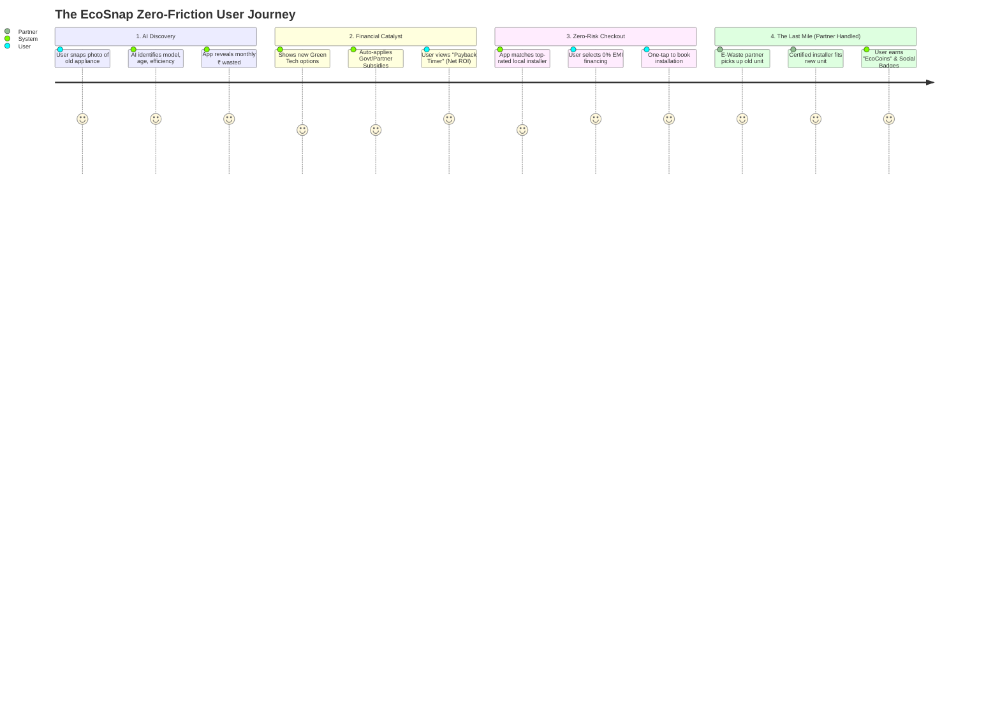
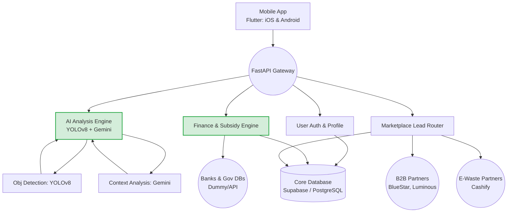

# 🚀 EcoSnap: The Master Pitch Document 
**"Making Sustainability the Most Logical Financial Decision You'll Ever Make"**

This document serves as the master blueprint for your pitch deck. It perfectly encapsulates the problem, the brilliant product pivots, the prototype, and the technical architecture.

---

## 🎯 1. The Core Idea & Problem Brief

### The Problem We Are Targeting
The world is in a climate crisis, yet **only 16% of consumers actually act on green initiatives.** Why? Because going green is currently a **luxury of time, money, and trust.** 

Consumers face four massive barriers:
1. **Financial Blindness:** People don't know that their 15-year-old AC is *costing* them an extra ₹6,000 a year in wasted electricity. They view a new, green AC as a ₹28,000 expense instead of a money-saving investment.
2. **The "Green Premium":** Green tech has high upfront costs. Even though government subsidies (like UJALA) exist, 95% of consumers have no idea how to claim them.
3. **Information Overload & Greenwashing:** Consumers don't know which brands to trust and fear buying fake "eco" products.
4. **Logistical Nightmare:** Finding a reliable installer, negotiating prices, and figuring out what to do with the old appliance is an exhausting, multi-step chore.

### The Solution: EcoSnap
EcoSnap is an AI-powered financial and lead-generation catalyst that removes every single friction point in green adoption. By simply snapping a photo of an old appliance, EcoSnap calculates the exact financial waste, instantly applies available government subsidies, and provides a one-tap booking with vetted installers. **We flip sustainability from an expensive chore into the most logical financial decision a consumer can make.**

---

## 🔀 2. The User Flow (Process Diagram)
This is the frictionless journey a user experiences from discovery to installation. This diagram is perfect for a dedicated slide illustrating "How It Works".

---

## 🦄 2. Unique Selling Propositions (USPs)
Don't pitch EcoSnap as just an "app"—pitch it as an **ecosystem disruptor**. Here are the winning USPs to highlight:

1. **Making the Invisible Cost Visible:** Our AI turns an abstract concept (tonnes of CO2) into hard, personalized financial data ("This AC costs you ₹500 extra per month").
2. **The "Zero-Friction" Upgrade:** EcoSnap integrates financing, government subsidies (e.g., UJALA), and vetted installation into a single 30-second workflow. A ₹28K expense becomes a 0% EMI "Net Positive Cashflow" investment.
3. **The Proxy Data Advantage (Smart Operations):** We don't rely on messy gig-worker models or complex utility APIs. We partner with established B2B networks (Blue Star, Luminous) for installation and e-waste recyclers (Cashify) for hardware disposal. We own the high-margin digital customer relationship; we offload the physical liability. 
4. **Hyper-Local FOMO (Social Proof):** The app maps local neighborhood installations ("41 of your Gomti Nagar neighbors saved ₹400/month last month"), turning sustainability into a gamified, peer-driven movement.

---

## 🛠️ 3. List of Features Offered by the Solution
A comprehensive suite of tools designed to guide the consumer from ignorance to installation:

1. **AI Visual Appliance Scanner:** Uses object detection to instantly identify legacy home appliances (ACs, Refrigerators, etc.) and calculate their exact electricity waste profile.
2. **The "Payback Timer" Dashboard:** A dynamic financial ROI calculator that illustrates exactly how many months it will take for the new appliance to completely pay for itself through energy savings.
3. **Instant Subsidy & EMI Engine:** Automatically discovers and applies government schemes (e.g., PM Surya Ghar, UJALA) and connects users to 0% interest EMI options through integrated banking partners.
4. **Certified Installer Marketplace:** A localized directory of verified B2B installation partners, complete with star ratings, localized pricing, and one-tap booking.
5. **The E-Waste Extractor:** An automated scheduling system that alerts ecosystem recycling partners (e.g., Cashify) to buy and remove the user's old hardware on the day of the new installation.
6. **Neighborhood Heatmaps & Leaderboards:** A social-proof feature showing how many neighbors have recently upgraded, fostering community-driven gamification and FOMO.
7. **The "Carbon-to-Trees" Translator:** Converts abstract carbon savings (Kg CO2) into easily understandable, shareable metrics like "Trees Planted" or "Social Badges" for gamified retention.

---

## 📱 4. The Prototype Overview
The hackathon prototype should demonstrate the "Aha!" moment—the transition from discovering waste to booking the upgrade.

**Key Demo Flows:**
1. **The Snap & Reveal:** The user opens the camera UI, snaps a photo of an AC or enters details regarding roof space. The app immediately reveals the monthly financial loss and carbon footprint.
2. **The Payback Timer Breakdown:** A highly-visual interactive chart shows a ₹28,000 upgrade but instantly subtracts an ₹8,000 government subsidy, mapping out the 70-month payback period.
3. **The Neighborhood Map:** A map view showing green dots in the user's localized area, establishing immediate social proof.
4. **The Checkout & Guarantee:** Selecting an installer (e.g., "Raj Kumar, 4.8⭐"), viewing the 5-year maintenance guarantee underwritten by the installer network, and booking the appointment. 

---

## 💼 5. Business Model & Go-To-Market (GTM)
To be a billion-dollar company, the revenue streams must be robust and diversified. EcoSnap is a B2B2C marketplace that monetizes the transaction, not the user.

**Revenue Streams:**
1. **Lead Generation & Affiliate Fees (Primary):** B2B partners (e.g., Blue Star, Luminous) and certified installers pay a premium (5–10% commission) for highly qualified, ready-to-buy leads.
2. **Financing Kickbacks:** We earn a fixed commission from financial institutions (NBFCs/Banks) for every 0% EMI loan originated through our platform.
3. **E-Waste Revenue Share:** E-waste companies (e.g., Cashify) pay a margin to EcoSnap for supplying bulk consumer electronics for recycling.
4. **Carbon Credit Aggregation (Future Phase):** As we pool thousands of home upgrades, we aggregate the verified CO2 savings and trade them on voluntary carbon markets.

**Go-To-Market Strategy:**
*   *Phase 1 (Growth Hack):* Gamify neighborhoods. "Your neighbor saved ₹400/mo." Lean into FOMO through highly shareable social badges.
*   *Phase 2 (B2B Partnerships):* Partner with Real Estate developers and landlords to bulk-upgrade legacy properties and split the increased property valuation.

---

## 🌍 6. Market Size (The "Why Now")
We are targeting the intersection of Climate Tech and Consumer Home Services.

*   **TAM (Total Addressable Market): $400B+** 
    *   The global home appliance and renewable energy upgrade market.
*   **SAM (Serviceable Addressable Market): $20B+**
    *   The Indian consumer electronics upgrade market + Subsidized Solar/HVAC installations over the next 5 years.
*   **SOM (Serviceable Obtainable Market): $500M**
    *   Capturing 2.5% of the Indian urban middle-class market actively looking to replace inefficient legacy appliances within the next 24 months.

---

## 🏗️ 7. Technical Architecture Diagram

To sell the technical capability of the project, use this architecture description to create a visual slide in your deck:

---

## 🖼️ 8. Wireframe Structure (Slide by Slide Flow)
When showing the UI on a slide, present it as a 4-step narrative:

*   **Screen 1 - "The Discovery" (Scan Mode):** Clean camera interface. A bounding box identifies an old window AC. Big red text: *"Warning: Operating at 40% efficiency. Wasting ₹5,000/year."*
*   **Screen 2 - "The Solution" (ROI Dashboard):** A beautiful glass-morphic breakdown showing the cost of a new AC, minus government subsidies, highlighting the "Net Payback: 70 Months" and the visual tree counter ("Equivalent to planting 50 trees").
*   **Screen 3 - "The Trust Layer" (Neighborhood Map):** A dark-mode map of the user's city with 41 glowing green dots representing nearby installations and localized savings stats.
*   **Screen 4 - "The Checkout" (Installer Network):** A list of top-rated, certified partner installers with clear "Book Now" buttons, an EMI opt-in slider, and the "Insured by Partner" badge. 

---

## 💻 9. Technology Stack

*   **Frontend (The Mobile Client):**
    *   **Flutter & Dart:** For cross-platform (iOS, Android, and Web) fluid UI and rapid iteration.
    *   **GoRouter & Provider/Riverpod:** For seamless app navigation and state management. 
*   **Backend (The Brains):**
    *   **Python & FastAPI:** Providing an incredibly fast, highly concurrent API gateway that easily interfaces with machine learning models.
    *   **PostgreSQL / Supabase:** For robust relational database management, handling users, leads, and financial datasets.
*   **Artificial Intelligence layer:**
    *   **Google Gemini Pro Vision / Text:** Processing the semantic understanding of the images and user chats (the conversational "Climate Assistant").
    *   **YOLOv8 (Ultralytics):** Native object detection models mapped for instant local appliance recognition without heavy latency.
*   **External Ecosystem (The APIs):**
    *   Mocked or real endpoints replicating Razorpay (financing), mapping services, and open utility guidelines. 

---

**Pitching Tip:** When you speak, do not talk about the code until asked. Talk about the *psychology* of the human being using the app, and how EcoSnap flips saving the planet from an "expensive chore" to a "data-backed money printer."
